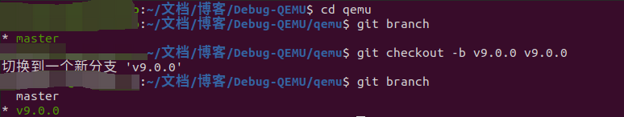

# Debug-QEMU
## 进入 qemu 目录
    选择想要调试的 QEMU 版本, 示例选择 tag v9.0.0 进行调试调试
    cd qemu
    git checkout -b v9.0.0 v9.0.0

## 构建 qemu
### 默认构建配置
    mkdir build
    cd build
    ../configure
    make
### 按照需求进行构建配置
#### 分析 configure 中的配置选项
##### 帮助信息和版本
```
--help|-h：显示帮助信息。
--version|-V：显示版本信息。
```
##### 编译器配置
```
--host-cc=*：设置主机编译器。比如 ：`--host-cc=/usr/bin/gcc`
--python=*：设置 Python 解释器。比如：`--python=/usr/bin/python3`
--skip-meson：跳过 Meson 构建系统。
--ninja=*：设置 Ninja 构建工具。比如：`--ninja=/usr/bin/ninja`
```
##### 构建选项-文档
```
--enable-docs 和 --disable-docs：启用或禁用文档生成。比如：`--enable-docs`或者`--disable-docs`
```
##### 构建选项-目标
```
--target-list=* 和 --target-list-exclude=*：设置目标列表或排除目标列表。比如：`--target-list=x86_64-softmmu`或者`--target-list-exclude=x86_64-softmmu`，或者ARM的：`--target-list=arm-softmmu`或者`--target-list-exclude=arm-softmmu`
```
##### 构建选项-设备
```
--with-default-devices 和 --without-default-devices：启用或禁用默认设备。
--with-devices-*：设置特定设备。比如：`--with-devices-usb`或者`--without-devices-usb`，这个设置指的是外设的支持。
```
##### 构建选项-调试
```
--enable-debug：启用调试选项。使能之后编译留下调试信息，可以对QEMU进行源码调试。
```
##### 构建选项-TCG
```
--disable-tcg 和 --enable-tcg：启用或禁用 Tiny Code Generator (TCG)。这个是用来打开或者关闭 TCG。TCG是用来将指令解析为宿主机指令的模块。
```
##### 构建选项-特定系统支持
```
--disable-system 和 --enable-system：禁用或启用系统级特性。这个选项可以启动指定的系统的特定支持，比如，--enable-system=linux：启用 QEMU 在 Linux 系统上的特定支持。--enable-system=windows：启用 QEMU 在 Windows 系统上的特定支持。
```
##### 构建选项-用户级支持
```
--disable-user 和 --enable-user：禁用或启用用户级特性。
用于启用用户级特性。用户级特性通常指的是 QEMU 提供给最终用户的一些功能或选项，以便用户能够自定义 QEMU 的行为或配置。启用 --enable-user 选项会包含一些针对最终用户的功能或选项，这些功能可能涉及到用户界面、命令行参数、配置文件等方面。通过启用 --enable-user 选项，可以让用户在运行 QEMU 时享有更多的自定义和控制权，以满足不同用户的需求。
这些用户级特性可以包括：
                    1.命令行选项：允许用户在命令行中指定不同的参数来配置 QEMU 的行为。
                    2.配置文件：允许用户通过配置文件来定义 QEMU 的默认行为和设置。
                    3.用户界面：提供图形化界面或交互式界面，让用户可以更直观地操作 QEMU。
```
##### 构建选项-linux用户级特性
```
--disable-linux-user 和 --enable-linux-user：禁用或启用 Linux 用户级特性。
```
##### 构建选项-bsd用户级特性
```
--disable-bsd-user 和 --enable-bsd-user：禁用或启用 BSD 用户级特性。
```
##### 构建选项-PIE功能
```
--enable-pie 和 --disable-pie：启用或禁用 Position Independent Executable (PIE)。
Position Independent Executable（PIE）是一种执行文件格式，其特点是可以加载到内存的任何位置而不会影响其执行。
PIE 是一种用于增强系统安全性的技术，因为它使得地址空间布局随机化 (ASLR) 成为可能，从而使得攻击者更难以利用潜在的安全漏洞。
在 QEMU 中，--enable-pie 和 --disable-pie 选项用于启用或禁用构建生成的二进制文件的 PIE 支持。
启用 --enable-pie 选项会使得 QEMU生成的二进制文件被标记为支持 PIE，而启用 --disable-pie 选项则会禁用这个特性。
启用 PIE 可以提高系统的安全性，因为它使得针对 QEMU 的攻击更难以实施。
然而，有些情况下可能需要禁用 PIE，例如在某些嵌入式系统中可能不支持PIE，或者某些情况下 PIE 可能会影响性能。因此--enable-pie 和 --disable-pie 选项允许用户根据实际需求来控制 PIE 的支持。
通常情况下，建议启用 PIE 支持以增强系统安全性，除非有特定的需求或限制要求禁用它。
```
##### 构建选项-CFI功能
```
--enable-cfi 和 --disable-cfi：启用或禁用 Control Flow Integrity (CFI)。
Control Flow Integrity (CFI) 是一种计算机安全技术，用于防止程序的控制流被恶意篡改或劫持，从而防止代码执行过程中出现攻击行为，如代码注入、代码重定向等。
CFI 技术通常会对程序的控制流进行严格的验证和限制，确保程序只能按照预先定义的控制流路径执行。
如果程序的控制流违反了这些预定义的路径，CFI 机制就会触发警报或阻止程序的执行，以防止潜在的攻击。
```
##### 构建选项-下载功能
```
--disable-download 和 --enable-download：禁用或启用下载。
```
##### 构建选项-插件支持
```
--enable-plugins 和 --disable-plugins：启用或禁用插件。
```
##### 构建选项-容器支持
```
--enable-containers 和 --disable-containers：启用或禁用容器支持。
```
##### 构建选项-容器引擎
```
--container-engine=*：设置容器引擎。
```
##### 构建选项-设置GDB的路径
```
--gdb=*：设置 GDB 路径。 
``` 
#### 按照自己的需求进行构建
示例的目标:
1.构建qemu-system-arm就可以，不需要编译其他版本的 qemu 。
2.使能调试选项，调试QEMU源码。 
注意：切记在全英文路径下构建和编译。。。。。 
```
mkdir build && cd build
../configure --enable-debug --target-list=arm-softmmu
make
中途可能遇到一些错误，一般提示缺少库。按照提示进行解决即可。
```
#### 验证
```
在 build 下存在 qemu-system-arm 即可。
可以运行开发板测试：
./qemu-system-arm -M vexpress-a9 -cpu cortex-a9 -kernel linux-4.9.0/arch/arm/boot/zImage -initrd linux-4.9.0/arch/arm/boot/dts/vexpress-v2p-ca9.dtb -append "root=/dev/ram rw console=ttyAMA0" -serial stdio
```
